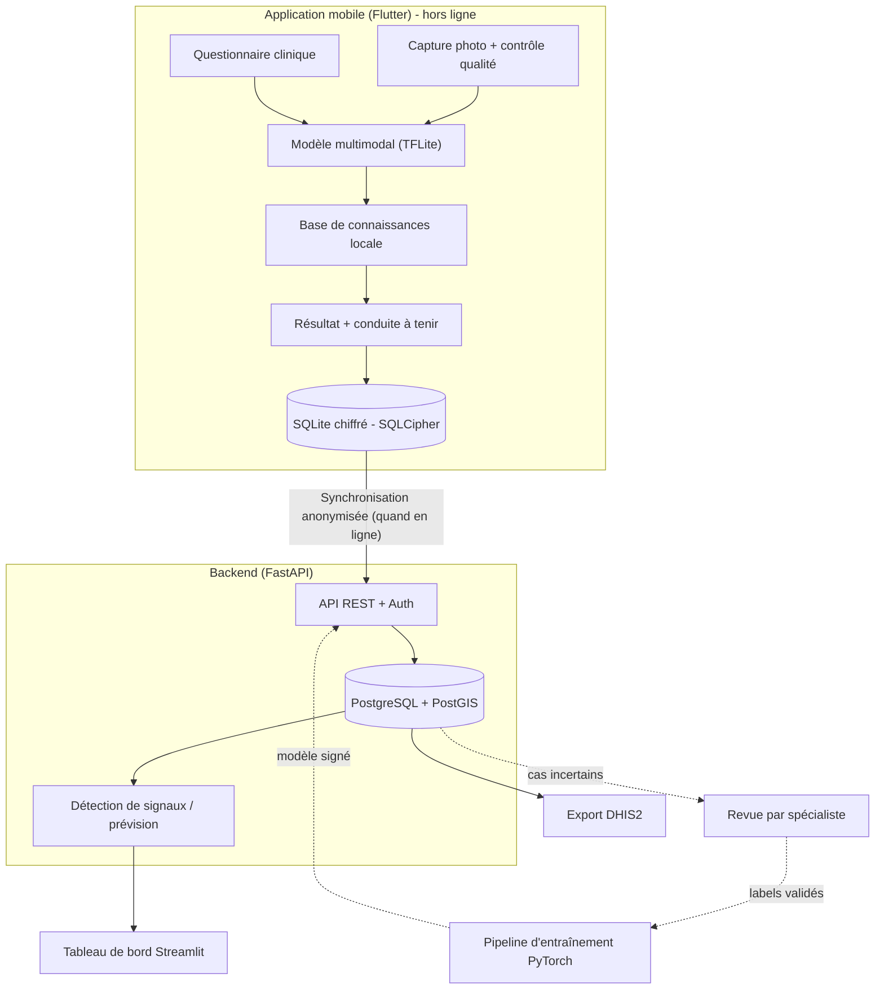

# DermIA

> **Aide au triage des maladies de peau tropicales, 100 % hors ligne, pour les agents de santé communautaires (ASC) au Cameroun.**


> ⚠️ **Avertissement.** DermIA est un projet de recherche en phase de conception. Ce n'est **pas** un dispositif médical validé. Il fournit une aide à l'orientation et des conseils de premiers soins ; il **ne pose pas de diagnostic définitif, ne prescrit pas, et ne remplace jamais un professionnel de santé.**

*« DermIA » est un nom de travail (le nom définitif reste à choisir ; vérifier au préalable les conflits de marque).*

---

## Table des matières

1. [À propos](#à-propos)
2. [Ce qui différencie DermIA](#ce-qui-différencie-dermia)
3. [Fonctionnalités](#fonctionnalités)
4. [Architecture](#architecture)
5. [Pile technique](#pile-technique)
6. [Démarrage rapide](#démarrage-rapide)
7. [Structure du dépôt](#structure-du-dépôt)
8. [Feuille de route](#feuille-de-route)
9. [Éthique, sécurité et conformité](#éthique-sécurité-et-conformité)
10. [Documentation](#documentation)
11. [Contribuer](#contribuer)
12. [Licence](#licence)
13. [Contact et remerciements](#contact-et-remerciements)

---

## À propos

Au Cameroun, les maladies de peau tropicales négligées (ulcère de Buruli, lèpre, pian, gale…) et les dermatoses courantes (teigne, impétigo, mycoses…) touchent surtout des zones rurales où les dermatologues sont très rares. Un diagnostic tardif a des conséquences lourdes : handicaps définitifs pour la lèpre, lésions étendues et chirurgie pour l'ulcère de Buruli.

DermIA équipe l'ASC d'un smartphone Android qui :

1. guide la **prise de photo** (cadrage, lumière, netteté) ;
2. pose quelques **questions cliniques ciblées** (la lésion est-elle indolore ? y a-t-il une perte de sensibilité ? depuis quand ? des cas dans le foyer ?) ;
3. combine photo et réponses dans un **modèle embarqué** qui propose une orientation avec un **niveau de confiance honnête** (et sait dire « je ne sais pas ») ;
4. affiche une **conduite à tenir** validée : signes d'alerte, premiers soins, quand et où référer ;
5. enregistre le cas **chiffré sur le téléphone** et le synchronise, anonymisé, dès qu'une connexion existe ;
6. alimente un **tableau de bord de surveillance** pour détecter précocement des foyers.

## Ce qui différencie DermIA

| Choix de conception | Pourquoi |
|---|---|
| **Offline-first intégral** | Le diagnostic, la base de connaissances et l'historique fonctionnent sans réseau. La synchronisation est un bonus. |
| **Multimodal : photo + questionnaire** | La lèpre se diagnostique en grande partie par la sensibilité et l'atteinte nerveuse, invisibles sur une photo. Fusionner image et signes cliniques améliore la fiabilité. |
| **Triage prudent, pas « diagnostic »** | Le modèle est calibré, signale les cas hors périmètre et privilégie la sensibilité sur les maladies graves. |
| **Peaux foncées d'abord** | Entraînement et évaluation stratifiés par type de peau (Fitzpatrick IV–VI), pas seulement une moyenne globale. |
| **Base de connaissances sous contrôle humain** | Les conseils sont rédigés et validés par des cliniciens (règles déterministes), jamais générés librement par une IA. |
| **Savoirs traditionnels avec niveaux de preuve** | Chaque remède est classé par niveau de preuve et ne doit jamais retarder la référence pour une maladie grave. |
| **Surveillance épidémique prudente** | Détection de signaux (agrégats spatio-temporels) d'abord ; prévision seulement quand les données le permettent. |
| **Interopérabilité** | Export vers les systèmes de santé existants (ex. DHIS2) plutôt qu'un silo de plus. |
| **Apprentissage avec l'humain dans la boucle** | Les cas incertains sont transmis à un spécialiste (télédermatologie asynchrone) ; ses réponses améliorent le modèle. |

## Fonctionnalités

Légende : ✅ prévu dans le MVP · 🔜 version ultérieure · 🔬 recherche

### Application mobile (Android)
- ✅ Capture photo guidée avec contrôle qualité (flou, exposition)
- ✅ Questionnaire clinique adaptatif (icônes, voix, FR/EN)
- ✅ Inférence locale (TFLite/LiteRT) avec confiance calibrée et rejet « hors périmètre »
- ✅ Conduite à tenir : urgence, premiers soins, référence
- ✅ Historique local chiffré (SQLCipher)
- 🔜 Suivi d'évolution d'une même lésion (taille, photos comparées)
- 🔜 Synchronisation sécurisée, mise à jour OTA du modèle
- 🔜 Langues locales et pidgin, consignes audio

### Modèle d'IA
- ✅ Classification multi-classes (NTD prioritaires, dermatoses courantes, peau saine, hors périmètre)
- ✅ Fusion image + symptômes
- ✅ Évaluation par classe et par type de peau
- 🔜 Explicabilité visuelle (Grad-CAM) pour l'ASC
- 🔬 Apprentissage fédéré / ré-entraînement avec labels d'experts

### Base de connaissances
- ✅ Fiches maladies (signes, diagnostics différentiels, urgence, référence)
- ✅ Soins modernes alignés sur les protocoles nationaux et ceux de l'OMS
- 🔜 Remèdes traditionnels classés par niveau de preuve
- 🔬 Signes cutanés d'alerte systémique (dépistage, à valider)

### Backend et tableau de bord
- 🔜 API FastAPI, authentification, PostgreSQL + PostGIS
- 🔜 Carte des signalements, tendances, alertes
- 🔬 Prévision avec covariables climatiques

## Architecture



Détails : [`docs/architecture.md`](docs/architecture.md).

## Pile technique

| Couche | Technologie |
|---|---|
| Entraînement | Python 3.11, PyTorch, timm (MobileNetV3 / EfficientNet-Lite), Albumentations |
| Conversion mobile | `ai-edge-torch` (PyTorch → TFLite) ; alternative : ONNX Runtime Mobile |
| Suivi d'expériences / données | MLflow, DVC |
| Mobile | Flutter (Android 8.0+), `tflite_flutter`, SQLCipher, `flutter_secure_storage` |
| Backend | FastAPI, SQLAlchemy 2, Alembic, PostgreSQL 15+ avec PostGIS |
| Tableau de bord | Streamlit, Plotly, Folium |
| Qualité | pytest, ruff, mypy, GitHub Actions |

> Le pipeline d'entraînement (PyTorch) et le pipeline de conversion sont isolés dans des environnements séparés pour éviter les conflits de dépendances (voir `ml/` et `docs/architecture.md`).

## Démarrage rapide

> L'installation détaillée de l'environnement est la prochaine étape du projet. Voici la trame prévue.

**Prérequis :** Git, Python 3.11, Flutter (canal stable), PostgreSQL 15+ avec PostGIS, Docker (recommandé). Sous Windows, utiliser WSL2 pour la conversion TFLite.

```bash
git clone https://github.com/<votre-compte>/dermia.git
cd dermia
cp .env.example .env            # puis renseigner les valeurs (ne jamais commiter .env)

# Environnement IA (entraînement)
python -m venv .venv-ml && source .venv-ml/bin/activate
pip install -r ml/requirements.txt

# Backend
python -m venv .venv-api && source .venv-api/bin/activate
pip install -r backend/requirements.txt
alembic upgrade head
uvicorn backend.app.main:app --reload

# Tableau de bord
streamlit run dashboard/app.py

# Mobile
cd mobile && flutter pub get && flutter run
```

## Structure du dépôt

```text
dermia/
├── backend/                  # API FastAPI (api/, core/, models/, schemas/, services/)
├── mobile/                   # Application Flutter (lib/screens, widgets, services, models)
├── ml/
│   ├── data/                 # raw/, processed/ (jamais commités : DVC)
│   ├── configs/              # hyperparamètres (YAML)
│   ├── notebooks/
│   ├── src/                  # datasets, modèles, entraînement, évaluation, calibration
│   └── export/               # conversion, quantification, benchmark TFLite
├── knowledge_base/           # fiches maladies versionnées (YAML/JSON) + sources
├── dashboard/                # Streamlit
├── docs/                     # cahier des charges, architecture, éthique, médical
├── tests/
├── scripts/
├── .env.example
└── README.md
```

## Feuille de route

| Phase | Contenu | Sortie attendue |
|---|---|---|
| **0 - Fondations** | Partenariats cliniques, comité d'éthique, protocole de collecte, audit des données | Protocole approuvé, premiers partenaires |
| **1 - Prototype IA** | Données publiques + locales, baseline, évaluation par type de peau | Modèle de référence et rapport d'évaluation |
| **2 - MVP mobile** | App hors ligne, questionnaire, KB moderne, historique chiffré | APK de test terrain |
| **3 - Validation terrain** | Étude pilote en conditions réelles, comparaison à l'avis d'un expert | Rapport de performance et d'usage |
| **4 - Sync et surveillance** | Backend, tableau de bord, détection de signaux, DHIS2 | Système de surveillance pilote |
| **5 - Savoirs traditionnels** | Base ethnobotanique avec niveaux de preuve | Module validé par des experts |
| **6 - Passage à l'échelle** | Langues locales, mises à jour OTA, apprentissage continu | Déploiement régional |

Le détail (livrables, critères d'acceptation, risques) est dans [`docs/cahier_des_charges.md`](docs/cahier_des_charges.md).

## Éthique, sécurité et conformité

- **Consentement éclairé** écrit ou oral documenté pour toute photo ; consentement distinct pour l'usage à des fins de recherche ou d'entraînement.
- **Minimisation** : pas de visage ni de nom ; métadonnées EXIF/GPS supprimées ; localisation grossière (aire de santé ou commune).
- **Chiffrement** des données au repos (SQLCipher, clés dans l'Android Keystore) et en transit (TLS).
- **Cadre légal** : loi n° 2024/017 du 23 décembre 2024 sur la protection des données à caractère personnel (entrée en application le 23 juin 2026), qui encadre notamment l'hébergement hors du pays. À faire valider par un juriste. Détails : [`docs/ethique_et_conformite.md`](docs/ethique_et_conformite.md).
- **Non-substitution** : l'outil oriente, il ne diagnostique ni ne prescrit.
- **Transparence** : performances par classe et par type de peau publiées, limites documentées.
- **Savoirs traditionnels** : consentement et partage des bénéfices avec les détenteurs de savoirs.

## Documentation

| Document | Contenu |
|---|---|
| [`docs/cahier_des_charges.md`](docs/cahier_des_charges.md) | Besoins, périmètre, exigences, planning, risques, indicateurs |
| [`docs/architecture.md`](docs/architecture.md) | Architecture, flux de données, synchronisation, pipeline IA, sécurité |
| [`docs/ethique_et_conformite.md`](docs/ethique_et_conformite.md) | Éthique, consentement, données, savoirs traditionnels, sécurité clinique |

## Contribuer

1. Forker le dépôt, créer une branche `feature/ma-fonctionnalite`.
2. Respecter ruff/mypy (Python) et `flutter analyze` (Dart) ; écrire des tests.
3. Aucune donnée patient, aucune clé ni aucun secret dans un commit.
4. Ouvrir une Pull Request décrivant le changement et son impact sur la sécurité clinique.

Les contributions médicales (relecture de fiches, protocoles) sont aussi précieuses que le code.

## Licence

À définir. Pistes : licence permissive (MIT/Apache-2.0) pour le code ; licence distincte pour les contenus médicaux (ex. CC BY-SA) ; **jeux de données et poids du modèle non redistribués** tant que le consentement et les accords de partage ne le permettent pas.

## Contact et remerciements

- Porteur du projet : `[Votre nom]` - `[email]`
- Partenaires visés : Ministère de la Santé publique, programmes nationaux de lutte contre les maladies tropicales négligées, OMS, structures hospitalières et centres de recherche, ASC et tradipraticiens partenaires.

*DermIA - Parce que chaque peau mérite d'être bien soignée.*
