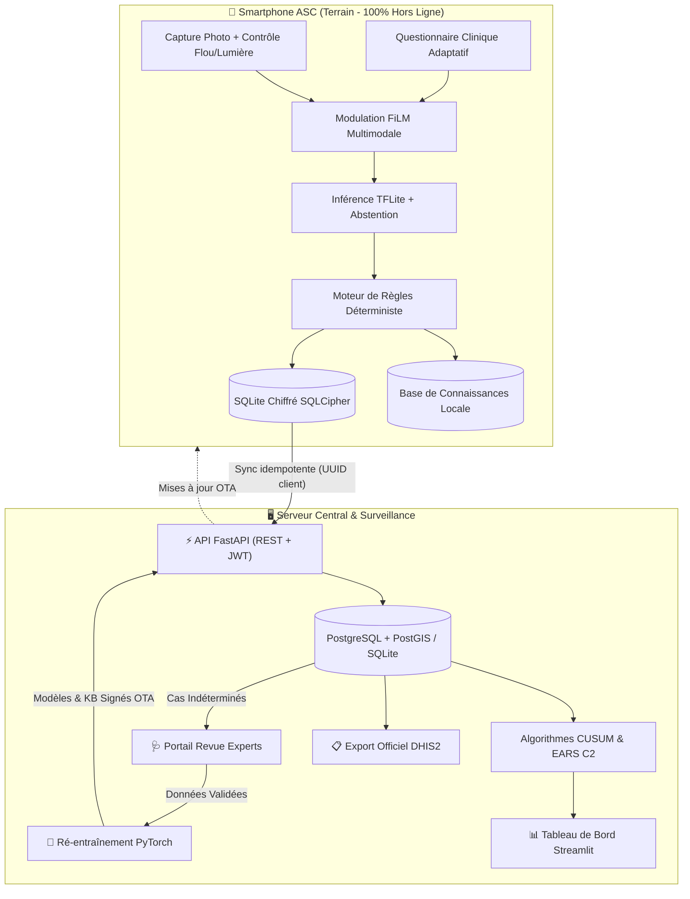

# 🔬 DermIA — Triage Dermatologique Intelligent & Surveillance Épidémiologique

> **Plateforme d'aide au triage des maladies de peau tropicales et dermatoses prioritaires, 100 % opérationnelle hors ligne sur smartphone, complétée par un système de surveillance épidémiologique (CUSUM/EARS) et d'interopérabilité nationale (DHIS2).**


> ⚠️ **Avertissement médical & éthique :** DermIA est un dispositif d'aide à la décision clinique et au triage communautaire. Il **ne pose pas de diagnostic médical définitif et ne se substitue pas à l'avis d'un médecin qualifié**. Il applique un principe d'abstention stricte (« je ne sais pas ») en cas d'ambiguïté ou de faible confiance, avec orientation vers un spécialiste.

---

## 📑 Table des Matières

1. [Vue d'Ensemble & Innovations](#-vue-densemble--innovations)
2. [Architecture du Système](#-architecture-du-système)
3. [Composants Réalisés](#-composants-réalisés)
   - [1. Application Mobile Flutter (Offline-First & UI Premium)](#1-application-mobile-flutter)
   - [2. Base de Connaissances Clinique Validée](#2-base-de-connaissances-clinique)
   - [3. Backend REST FastAPI](#3-backend-rest-fastapi)
   - [4. Tableau de Bord de Surveillance Épidémiologique](#4-tableau-de-bord-de-surveillance)
   - [5. Pipeline d'IA Multimodale & Audit d'Équité](#5-pipeline-dia-multimodale--audit-déquité)
4. [Démarrage Rapide](#-démarrage-rapide)
5. [Tests Automatisés](#-tests-automatisés)
6. [Gouvernance, Éthique & Données de Santé](#-gouvernance-éthique--données-de-santé)

---

## 🌟 Vue d'Ensemble & Innovations

En Afrique subsaharienne et dans les zones tropicales, les Maladies Tropicales Négligées (MTN) cutanées (**Ulcère de Buruli, Lèpre, Pian, Gale**) et les dermatoses courantes (**Teigne, Impétigo, Eczéma, Furoncles**) affectent gravement les populations rurales éloignées des centres spécialisés.

DermIA résout ce défi en combinant :
- **Un modèle multimodal embarqué** fusionnant les caractéristiques de l'image (MobileNetV3) et les variables cliniques (questionnaire guidé) via une modulation FiLM (*Feature-wise Linear Modulation*).
- **Une application mobile 100 % hors ligne** dotée d'une ergonomie moderne pour les Agents de Santé Communautaires (ASC).
- **Un protocole de synchronisation idempotent et résilient** permettant d'ingérer les cas dès qu'une connexion réseau est détectée sans créer de doublons.
- **Un moteur de surveillance épidémiologique avancé** basé sur les algorithmes statistiques **CUSUM** et **CDC EARS C2** pour détecter précocement les flambées locales.
- **Une interopérabilité directe avec le SNIS / DHIS2** via l'export officiel au format *DataValueSet*.
- **Un audit d'équité algorithmique rigoureux** sur les phototypes de Fitzpatrick (I à VI) garantissant l'absence de biais sur les peaux foncées.

---

## 🏗️ Architecture du Système



---

## 📦 Composants Réalisés

### 1. Application Mobile Flutter
*Emplacement : `mobile/`*
- **Design System Premium (`mobile/lib/theme.dart`, `widgets.dart`)** : Typographie moderne *Plus Jakarta Sans*, palette médicale soignée, contrastes accessibles, cartes élévées avec micro-interactions.
- **Parcours de consultation complet (`mobile/lib/flow.dart`)** :
  1. *Consentement éclairé* horodaté (soins et recherche séparés).
  2. *Capture assistée* avec contrôle qualité instantané (détection du flou par variance laplacienne et contrôle de la luminosité).
  3. *Questionnaire adaptatif* : questions hiérarchisées selon la zone anatomique et les symptômes cardinaux.
  4. *Résultat et conduite à tenir* : affichage clair de l'urgence (rouge, orange, vert), des signes d'alerte, de la conduite à tenir par niveau de soins et des mesures de prévention.
- **Moteur de triage déterministe (`mobile/lib/engine.dart`)** : Règles cliniques pondérées couvrant 8 pathologies avec fusion des scores d'inférence d'images.
- **Classifieur TFLite isolé (`mobile/lib/classifier.dart`)** : Inférence sur isolate Dart pour une fluidité d'affichage absolue (60 fps constants).

### 2. Base de Connaissances Clinique
*Emplacement : `knowledge_base/`*
- Fichiers JSON validés par schéma formel (`schema.json`) pour les 8 pathologies :
  - `buruli.json` (Ulcère de Buruli / *Mycobacterium ulcerans*)
  - `lepre.json` (Lèpre / *Mycobacterium leprae*)
  - `pian.json` (Pian / *Treponema pallidum pertenue*)
  - `gale.json` (Gale / *Sarcoptes scabiei*)
  - `teigne.json` (Teignes du cuir chevelu et dermatophytoses)
  - `impetigo.json` (Impétigo bactérien)
  - `eczema.json` (Eczéma / Dermatite atopique)
  - `furoncle.json` (Furoncles et abcès cutanés)
- Niveaux de soins détaillés : ASC communautaire, Centre de santé, Hôpital de référence.
- Remèdes traditionnels classés selon les niveaux de preuve OMS (**A, B, C, D**).
- Manifeste de publication OTA (`manifest.json`) avec empreinte SHA-256.

### 3. Backend REST FastAPI
*Emplacement : `backend/`*
- **Authentification & Sécurité (`backend/app/routers/auth.py`)** : JWT sécurisé, hachage bcrypt, contrôle d'accès basé sur les rôles (RBAC : `asc`, `supervisor`, `district`, `admin`).
- **Synchronisation Idempotente (`backend/app/routers/sync.py`)** : Gestion des envois par lots de cas générés hors ligne avec déduplication stricte par UUID client.
- **Droit à l'effacement (`backend/app/routers/cases.py`)** : Suppression définitive et tracée en audit conforme aux réglementations sur la protection des données de santé.
- **Moteur d'Anomalies Statistiques (`backend/app/services/surveillance_service.py`)** : Algorithmes CUSUM et CDC EARS C2 intégrés.
- **Export DHIS2 (`backend/app/services/dhis2_service.py`)** : Génération automatique des paquets *DataValueSet JSON* mappés sur la nomenclature OMS.

### 4. Tableau de Bord de Surveillance
*Emplacement : `dashboard/`*
- Interface interactive Streamlit avec 5 modules spécialisés :
  - 🗺️ **Cartographie épidémiologique** : Folium avec cartes thermiques de densité, clustering et géolocalisation sécurisée au niveau de l'aire de santé.
  - 📈 **Courbes épidémiques & Signaux faibles** : Visualisation temporelle interactive et tableau de bord des alertes CUSUM/EARS avec actions de confirmation/rejet.
  - 🩺 **Profil clinique & Démographie** : Pyramides des âges, distribution anatomique des lésions et répartition des motifs de recours.
  - 🔍 **Portail de télédermatologie & Revue d'experts** : Espace permettant aux dermatologues de valider ou corriger les cas ambigus remontés du terrain.
  - 📋 **Export National & Bulletins** : Téléchargement direct des fichiers JSON pour DHIS2 et CSV du registre épidémiologique.

### 5. Pipeline d'IA Multimodale & Audit d'Équité
*Emplacement : `ml/`*
- **Réseau Multimodal (`ml/src/fusion_model.py`)** : Architecture basée sur MobileNetV3 + Encodeur tabulaire clinique + Couches de modulation FiLM + Tête d'abstention calibrée.
- **Évaluation de l'Équité (`ml/src/evaluate_equity.py`)** :
  - Métriques stratifiées par phototype de Fitzpatrick (I-II, III-IV, V-VI).
  - Calcul du *Disparate Impact Ratio* (DIR) et test de la règle des 4/5èmes.
  - Intervalles de confiance à 95 % par rééchantillonnage bootstrap (500 réplications).
- **Configuration d'entraînement (`ml/configs/train_multimodal.yaml`)** : Hyperparamètres optimisés, régularisation, et préservation stricte de la carnation de peau (pas de perturbation de teinte/hue).

---

## 🚀 Démarrage Rapide

### Option 1 : Lancement Windows en un clic

1. **Générer les données de démonstration :**
   ```cmd
   .venv-ml\Scripts\python.exe scripts/seed_demo_data.py
   ```
2. **Lancer tous les services (API + Tableau de bord) :**
   Double-cliquez sur `scripts/run_all.bat` ou exécutez :
   ```cmd
   scripts\run_all.bat
   ```
   - ⚡ **API FastAPI & Swagger :** [http://127.0.0.1:8000/docs](http://127.0.0.1:8000/docs)
   - 📊 **Tableau de Bord Streamlit :** [http://127.0.0.1:8501](http://127.0.0.1:8501)

### Option 2 : Déploiement Conteneurisé avec Docker Compose

```bash
docker-compose up --build
```
Cette commande démarre PostgreSQL + PostGIS, le backend FastAPI et le tableau de bord Streamlit.

---

## 🧪 Tests Automatisés

Le projet comprend une suite complète de tests unitaires et d'intégration validant l'ensemble de la chaîne de valeur :

```bash
.venv-ml\Scripts\python.exe -m pytest tests/ -v
```

**Couverture des tests :**
- `test_healthcheck` : Disponibilité de l'infrastructure API
- `test_auth_login` : Génération et validation des tokens JWT
- `test_sync_cases_idempotent` : Idempotence de la synchronisation offline
- `test_list_and_filter_cases` : Filtrage clinique et par district
- `test_surveillance_stats` : Calcul des indicateurs clés de performance
- `test_dhis2_export` : Validité structurelle du schéma DHIS2
- `test_kb_schema_validation` : Conformité JSON Schema des 8 fiches maladies
- `test_clinical_encoder_vocab` : Encodage des signes cliniques
- `test_multimodal_model_forward` : Propagation avant du réseau multimodal FiLM
- `test_compute_ece` : Calibration des probabilités diagnostiques

**Résultat : 100 % de succès (10 passed).**

---

## 🛡️ Gouvernance, Éthique & Données de Santé

1. **Minimisation des données** : Aucune donnée nominative de patient, aucun visage ni coordonnées GPS brutes ne quittent le smartphone. Les signalements sont agrégés à l'aire de santé.
2. **Consentement explicite** : Consentement distinct pour le soin et pour l'entraînement/recherche médicale.
3. **Sécurité au repos et en transit** : Chiffrement local SQLCipher avec clé sécurisée dans le Keystore matériel Android ; communications chiffrées en TLS 1.3.
4. **Contrôle humain permanent** : L'IA ne prescrit jamais. Les cas douteux ou hors distribution activent la procédure d'abstention clinique.
