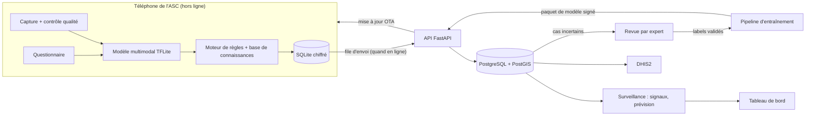

# Architecture technique - DermIA

## 1. Vue d'ensemble



Principe directeur : **tout ce qui sert au diagnostic vit sur le téléphone.** Le serveur n'est jamais sur le chemin critique d'une consultation.

## 2. Application mobile

### 2.1 Choix
- **Flutter**, Android 8.0+. Un seul code, bonne performance, écosystème TFLite.
- **TFLite / LiteRT** via `tflite_flutter`, avec délégué GPU/NNAPI quand disponible et repli CPU (téléphones d'entrée de gamme).
- **Stockage** : SQLite chiffré avec SQLCipher ; clé générée sur l'appareil et protégée par l'Android Keystore (`flutter_secure_storage`). Les photos sont stockées chiffrées, jamais dans la galerie publique.
- **Pas de dépendance réseau** dans le parcours de consultation.

### 2.2 Parcours d'une consultation
1. Consentement enregistré (horodaté, type : soins / recherche).
2. Capture guidée → contrôle qualité local (netteté, exposition, taille de la lésion dans le cadre). Refus avec explication si insuffisant.
3. Questionnaire adaptatif (les questions dépendent de la zone et des premières réponses).
4. Inférence : probabilités calibrées ; test d'abstention (hors distribution / confiance faible).
5. Moteur de règles : combine le résultat et les réponses → niveau d'urgence, signes d'alerte, conduite à tenir.
6. Enregistrement local, état de synchronisation « en attente ».

### 2.3 Synchronisation (offline-first)
- **File d'envoi (outbox)** : chaque cas reçoit un UUID généré sur l'appareil ; l'envoi est **idempotent** (rejouer ne crée pas de doublon).
- **Envoi incrémental** par petits lots, reprise après coupure, compression des images, priorité aux métadonnées légères.
- **Conflits** : les cas sont des enregistrements ajoutés (append-only) ; les corrections créent une nouvelle version. Peu de conflits par construction.
- **Données descendantes** : paquets signés (modèle, base de connaissances, protocoles) téléchargés quand le réseau le permet ; vérification de signature avant activation ; retour arrière possible.
- **Alternatives sans Internet** (phase ultérieure) : export chiffré vers un autre téléphone ou une clé, utile aux zones sans couverture.

## 3. Pipeline d'IA

### 3.1 Étapes
```
données → nettoyage/déduplication → découpage par patient → entraînement
→ calibration → évaluation stratifiée → quantification → conversion
→ benchmark sur appareils → signature → publication
```

### 3.2 Modèle
- **Entrée** : image 224×224 (ou 256×256) + vecteur clinique (réponses du questionnaire encodées).
- **Backbone** : MobileNetV3 ou EfficientNet-Lite (pré-entraîné ImageNet puis sur jeux de dermatologie).
- **Fusion** : caractéristiques image concaténées avec le vecteur clinique (ou modulation FiLM) → tête de classification.
- **Sorties** : probabilités par classe, plus une tête ou un score pour l'abstention.
- **Entraînement** : pertes adaptées aux classes rares (focal loss ou pondération), augmentations réalistes (lumière, flou, rotation, variation de balance des blancs), échantillonnage équilibré. Éviter les augmentations qui altèrent la couleur de la peau de façon irréaliste.
- **Enseignant/élève** : un modèle plus grand (ou un modèle de fondation dermatologique, sous réserve de licence et de conditions d'usage) fournit des cibles souples pour distiller le modèle mobile.
- **Calibration** : mise à l'échelle par température sur un jeu de validation distinct ; suivi de l'erreur de calibration attendue (ECE).
- **Abstention** : seuils sur la confiance et sur un score hors distribution, réglés pour garantir la sensibilité sur les classes graves.

### 3.3 Évaluation
- Découpage **par patient** ; jeu de test **externe** (autre site/appareil).
- Métriques : sensibilité, spécificité, F1 par classe ; F1 macro ; top-3 ; ECE ; matrice de confusion avec attention aux confusions cliniquement dangereuses (ex. Buruli ↔ autres ulcères, lèpre ↔ dermatoses dépigmentées).
- **Découpes** : par type de peau, âge, sexe, zone du corps, qualité d'image, appareil.
- Intervalles de confiance par rééchantillonnage (bootstrap) : sur de petits échantillons, un chiffre sans intervalle est trompeur.
- Comparaison à l'avis de cliniciens sur un sous-échantillon.

### 3.4 Déploiement mobile
- **Conversion** : `ai-edge-torch` (PyTorch → TFLite), exécutée sous Linux/WSL2 dans un environnement dédié. Repli : export ONNX + ONNX Runtime Mobile.
- **Quantification** : float16 ou int8 avec jeu de calibration représentatif ; **vérifier la perte de performance** par classe après quantification.
- **Benchmark** : latence, mémoire et énergie sur 3 à 4 téléphones de référence (bas, moyen de gamme) ; test d'équivalence entre sorties PyTorch et TFLite sur un lot d'images.
- **Versionnement** : `modele_vX.Y.Z` + empreinte des données + configuration ; modèle signé.

### 3.5 MLOps léger
- **DVC** pour les données, **MLflow** pour les expériences, fichiers de configuration YAML, graine aléatoire fixée, rapport d'évaluation généré automatiquement et archivé avec chaque version.

## 4. Base de connaissances

- Fichiers **versionnés** (YAML/JSON) dans `knowledge_base/`, un par maladie, validés par schéma.
- Champs : identifiant, noms (FR/EN/locaux), signes évocateurs, diagnostics différentiels, signes d'alerte, urgence, conduite à tenir par niveau de soins, critères de référence, prévention, sources, relecteurs, date, version.
- **Moteur de règles déterministe** : le texte affiché vient de ces fiches, pas d'un générateur de texte. Chaque règle est traçable jusqu'à sa source et relue par un clinicien.
- **Remèdes traditionnels** (phase 5) : champ séparé avec niveau de preuve :

| Niveau | Signification | Traitement dans l'app |
|---|---|---|
| A | Efficacité et innocuité étayées par des essais cliniques | Peut être proposé comme soin complémentaire |
| B | Données précliniques ou observationnelles encourageantes | Proposé avec réserve, sans promesse d'efficacité |
| C | Usage traditionnel seulement | Information, pas de recommandation |
| D | Risque connu (caustique, allergisant, interaction) | Mise en garde explicite |

  Règle : pour les maladies graves (ex. ulcère de Buruli, lèpre), aucun remède traditionnel ne figure à la place de la référence ; le message « ne retardez pas la consultation » est systématique.

## 5. Backend (phase 4)

### 5.1 Composants
- **FastAPI** (REST), **SQLAlchemy 2** + **Alembic** (migrations), **PostgreSQL + PostGIS**.
- **Auth** : comptes ASC liés à une structure de santé ; JWT à durée courte + jeton de renouvellement ; rôles (ASC, superviseur, district, admin) ; limitation de débit.
- **File de tâches** (si nécessaire) pour traitements différés (ex. anonymisation d'images, calculs de signaux).

### 5.2 Modèle de données (simplifié)

| Table | Champs principaux |
|---|---|
| `health_workers` | id, structure_id, rôle, statut |
| `facilities` | id, nom, aire de santé, district, région, géométrie |
| `cases` | uuid, agent_id, date, tranche d'âge, sexe, zone du corps, réponses (JSON), version_modele, sortie_modele (JSON), confiance, décision de l'ASC, urgence, aire de santé, géométrie grossière |
| `images` | id, case_uuid, chemin chiffré, consentement_recherche, hash |
| `expert_reviews` | id, case_uuid, expert_id, label validé, commentaire, date |
| `alerts` | id, type, zone, période, score, statut (à confirmer / confirmée / rejetée) |
| `model_releases` | version, hash, signature, métriques, date, statut |
| `kb_releases` | version, hash, signature, date |
| `audit_log` | acteur, action, objet, date |

### 5.3 Points d'API (esquisse)

| Méthode | Route | Rôle |
|---|---|---|
| POST | `/auth/login` | Authentification |
| POST | `/sync/cases` | Envoi d'un lot de cas (idempotent) |
| POST | `/sync/images` | Envoi d'images (si consentement) |
| GET | `/releases/model/latest` | Dernier modèle signé |
| GET | `/releases/kb/latest` | Dernière base de connaissances |
| GET | `/dashboard/cases` | Données agrégées (rôles autorisés) |
| GET | `/dashboard/alerts` | Alertes |
| POST | `/reviews` | Retour d'expert |
| DELETE | `/cases/{uuid}` | Droit à l'effacement |

### 5.4 Hébergement
Choisir un hébergeur après analyse de conformité (voir `ethique_et_conformite.md`). Si un fournisseur étranger est envisagé, obtenir l'autorisation requise avant toute donnée réelle. En développement : données synthétiques ou publiques uniquement.

## 6. Surveillance épidémique

La « prédiction d'épidémies » est abordée en trois niveaux, du plus robuste au plus exploratoire :

1. **Descriptif** : cartes et tendances par maladie, aire de santé et semaine.
2. **Détection de signaux** : méthodes classiques (CUSUM/EARS pour les anomalies de série temporelle ; statistique de balayage spatio-temporel pour les agrégats). Les alertes sont des **hypothèses à vérifier** par le district, jamais des conclusions.
3. **Prévision** : modèles de séries temporelles (ARIMA/ETS, modèles de comptage) avec covariables environnementales (pluviométrie, température, proximité de cours d'eau pour l'ulcère de Buruli), **uniquement après 12 mois ou plus de données** stables.

Limites à documenter : biais de déclaration (les zones bien équipées déclarent plus), faible effectif au départ, ambiguïté entre variation réelle et variation de couverture par les ASC. Les maladies à évolution lente (lèpre, Buruli) se prêtent surtout à la détection de foyers, la gale et les infections cutanées à la détection d'épidémies locales (écoles, foyers collectifs).

**Confidentialité** : agrégation à l'aire de santé ; masquage des cellules à faible effectif (ex. moins de 5 cas) ; pas de coordonnées précises à l'extérieur du téléphone.

**Interopérabilité** : export agrégé vers DHIS2 pour s'intégrer aux circuits officiels de notification.

## 7. Sécurité

| Couche | Mesures |
|---|---|
| Appareil | Verrouillage de l'app, SQLCipher, clés dans le Keystore, photos hors galerie, effacement à distance/local, détection de root (avertissement) |
| Transport | TLS 1.2+, épinglage de certificat, signature des paquets de modèle et de connaissances |
| Serveur | Moindre privilège, secrets hors dépôt, journal d'audit, sauvegardes chiffrées, mises à jour de sécurité |
| Données | Pseudonymisation, suppression EXIF/GPS, généralisation géographique, séparation identifiants/contenu clinique |
| Développement | Revue de code, analyse de dépendances, aucun secret dans git, données réelles interdites en dev/CI |

## 8. Environnements Python

Trois environnements isolés :

| Environnement | Contenu | Raison |
|---|---|---|
| `ml` | PyTorch, torchvision, timm, albumentations, scikit-learn, MLflow, DVC | Entraînement et évaluation |
| `export` | `ai-edge-torch`, TensorFlow/LiteRT | Conversion et benchmark (Linux ou WSL2 ; dépendances lourdes et sensibles aux versions) |
| `api` | FastAPI, SQLAlchemy, Alembic, psycopg, Streamlit, Plotly, Folium | Backend et tableau de bord |

Les versions exactes seront figées à l'étape d'installation (fichiers verrouillés, testés ensemble).

## 9. Tests et qualité

- **IA** : tests de non-régression des métriques, test d'équivalence PyTorch/TFLite, tests d'invariance (rotation légère, luminosité) et de robustesse (flou, compression).
- **Mobile** : tests unitaires et d'intégration, tests hors ligne (mode avion), tests sur appareils d'entrée de gamme.
- **Backend** : pytest, tests de contrat d'API, tests d'idempotence de la synchronisation.
- **Clinique** : relecture croisée des fiches ; revue des erreurs graves ; procédure de retrait d'un modèle fautif.
- **CI** : lint, tests, vérification de schémas, analyse de dépendances à chaque PR.

## 10. Décisions ouvertes (à trancher en phase 0)

1. Hébergement des données (Cameroun ou autorisation pour hébergement étranger).
2. Statut juridique de l'outil (aide à l'orientation vs dispositif médical).
3. Modèle de fondation dermatologique : licence et conditions d'usage compatibles ?
4. Liste finale des classes selon les données réellement disponibles.
5. Licence du code, des contenus médicaux, des poids du modèle.
